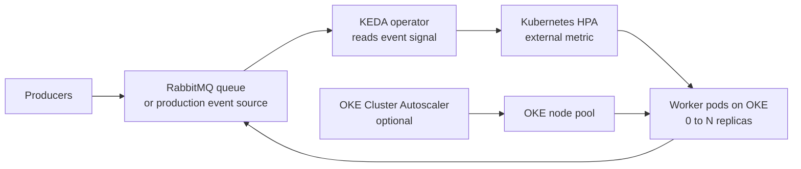

# Event-Driven Autoscaling on Oracle Cloud Infrastructure with KEDA

Run Kubernetes workloads on Oracle Cloud Infrastructure (OCI) that scale for the work actually waiting to be processed. This solution deploys KEDA on Oracle Kubernetes Engine (OKE), together with a small RabbitMQ-backed worker demonstration. It is intended as a practical starting point: replace the demonstration queue with your production event source when you are ready.

## Why KEDA?

Kubernetes Horizontal Pod Autoscaler (HPA) usually scales pods from CPU and memory. That is useful, but it is often late for event-processing applications: a worker can be idle while a queue accumulates thousands of messages. **KEDA (Kubernetes Event-driven Autoscaling)** adds event-aware signals such as queue depth, stream lag, and custom Prometheus metrics.

KEDA does not replace HPA. Its operator watches a `ScaledObject`, activates a workload from zero to one when work arrives, and creates/manages an HPA to scale it from one to many replicas. When the work becomes idle, KEDA can return the workload to zero replicas. KEDA also provides `ScaledJob` for short-lived, batch-style workers.



The two scaling layers solve different problems. KEDA scales **pods**; the OKE Cluster Autoscaler can add or remove **nodes** when pods cannot be scheduled. Use both for a genuinely elastic worker platform.

## What the one-click deployment creates

The companion Terraform repository should create the following resources in a compartment you choose:

| Layer | Resource | Purpose |
| --- | --- | --- |
| OCI foundation | VCN, private worker subnets, security rules, optional NAT gateway | Isolated network for OKE workers |
| Kubernetes | OKE cluster and managed node pool | Runs KEDA and the sample workload |
| Platform add-ons | Metrics Server and OKE Cluster Autoscaler (optional) | Kubernetes metrics and node elasticity |
| Event scaling | KEDA Helm release, namespace, and CRDs | Event-driven pod scaling |
| Demonstration | RabbitMQ, worker Deployment, and `ScaledObject` | A safe, visible proof that scaling works |

Keep worker nodes private. Use an OCI Vault secret (or a Kubernetes Secret sourced from Vault) for queue credentials; never commit credentials, kubeconfig files, or Terraform state to GitHub.

## How the demonstration works

The worker reads messages from the `orders` queue. The `ScaledObject` below starts with zero workers, activates as soon as the queue has a message, and aims for roughly five messages per worker. It limits the demo to ten workers and waits five minutes before scaling down.

```yaml
apiVersion: keda.sh/v1alpha1
kind: ScaledObject
metadata:
  name: orders-worker
  namespace: demo
spec:
  scaleTargetRef:
    name: orders-worker
  minReplicaCount: 0
  maxReplicaCount: 10
  pollingInterval: 30
  cooldownPeriod: 300
  triggers:
    - type: rabbitmq
      metadata:
        protocol: amqp
        mode: QueueLength
        value: "5"
        queueName: orders
      authenticationRef:
        name: rabbitmq-trigger-auth
```

The `TriggerAuthentication` resource should read the AMQP connection string from a Kubernetes Secret. For a production service, tune the queue-per-worker target using observed processing time, concurrency, queue partitioning, downstream limits, and failure/retry behavior—not just an arbitrary replica limit.

## Deploy in four steps

1. Clone the Terraform repository and copy `terraform.tfvars.example` to `terraform.tfvars`.
2. Set only the required OCI inputs: tenancy and compartment OCIDs, region, availability domain or node-pool placement, SSH key, and an approved CIDR range. Store sensitive variables through your CI secret store or OCI Vault.
3. Run `terraform init`, `terraform plan`, and `terraform apply`. The Terraform outputs should include the cluster OCID, regional API endpoint, and a command for creating or refreshing kubeconfig.
4. After Terraform finishes, confirm the installation and generate a few test messages:

```bash
kubectl get pods -n keda
kubectl get scaledobject -n demo
kubectl get hpa -n demo
kubectl describe scaledobject orders-worker -n demo
```

The worker count should rise as the queue grows and return to zero after the queue is empty and the configured cooldown expires.

## Production choices and guardrails

Start with one scaler that matches the application’s real source of work. KEDA has built-in scalers for common technologies, including Kafka, RabbitMQ, Redis, Prometheus, and HTTP-based metrics. OCI Streaming is not a built-in KEDA scaler; use a Prometheus exporter plus KEDA’s Prometheus scaler, or implement an external scaler, and validate its authentication and rate limits before production use.

Avoid attaching a separate HPA to the same Deployment: KEDA creates and owns an HPA for its `ScaledObject`. Set resource requests and limits on every worker so Kubernetes can schedule reliably, use a PodDisruptionBudget where appropriate, and enable node autoscaling when scale-out may need extra capacity. Monitor KEDA operator logs, `ScaledObject` events, HPA status, queue depth, processing latency, and dead-letter activity.

Scale-to-zero is powerful for asynchronous workers, but it is not automatically suitable for synchronous request paths, workloads with long warm-up times, or consumers that cannot safely be stopped. In those cases use `minReplicaCount: 1` or a nonzero floor.

## Learn next

Begin with these concepts: a Kubernetes Deployment runs your workers; an HPA changes their replica count; a KEDA `ScaledObject` connects the Deployment to an event signal; and `TriggerAuthentication` keeps that connection secure. Then run the demo, change `value` from `5` to `20`, and observe how the replica decision changes. That small experiment makes the configuration concrete before applying it to production queues.

For implementation detail, see the [KEDA concepts documentation](https://keda.sh/docs/latest/concepts/), [KEDA scaling behavior](https://keda.sh/docs/latest/concepts/scaling-deployments/), and OCI’s guidance on [autoscaling OKE node pools and pods](https://docs.oracle.com/en-us/iaas/Content/ContEng/Tasks/contengautoscalingclusters.htm). Oracle Solution Hub publishing normally requires your organization’s authoring access and review workflow; submit this page with the Terraform GitHub URL once that repository is public and validated.

